# Architecture

How the pieces fit together, drawn rather than described. Every diagram
answers one question; the prose above each says which.

For running and deploying the system see [DEPLOYMENT.md](DEPLOYMENT.md); for
who may call what, [PERMISSIONS.md](PERMISSIONS.md); for the Terraform layout,
[infra/README.md](../infra/README.md).

## Contents

- [What runs where](#what-runs-where)
- [How a request is authorized](#how-a-request-is-authorized)
- [How an account is created](#how-an-account-is-created)
- [How a profile picture gets uploaded](#how-a-profile-picture-gets-uploaded)
- [How the backend modules depend on each other](#how-the-backend-modules-depend-on-each-other)
- [What the authorization pieces actually expose](#what-the-authorization-pieces-actually-expose)
- [What changes over time](#what-changes-over-time)
- [What the database holds](#what-the-database-holds)
- [What Terraform builds, and who may touch it](#what-terraform-builds-and-who-may-touch-it)
- [How a change reaches production](#how-a-change-reaches-production)
- [Why it differs from the plan](#why-it-differs-from-the-plan)

---

## What runs where

One GCP project, `shpe-webapp`. The browser talks to two things — the static
site and the API — and the API is the only thing that talks to the database.
Google Calendar is an inbound source, not something members reach.

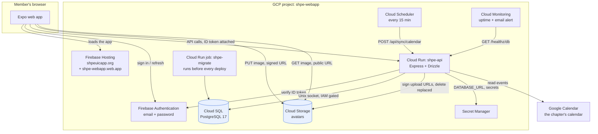

## How a request is authorized

The question this answers: *why does promoting someone take effect
immediately, without them signing out?*

Because the role is never read from the token. The token proves identity;
Postgres decides what that identity may do, and it is consulted on every
single request.

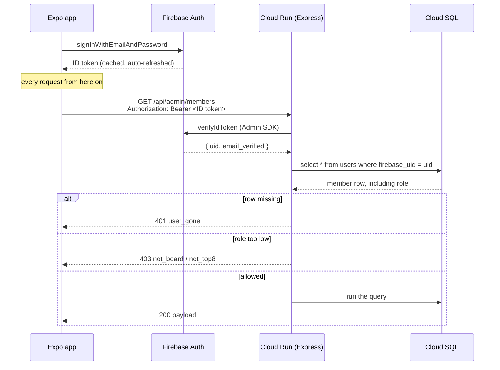

**The verification claim is read here but not acted on.** `loadSession` puts
`email_verified` on the request and `GET /api/auth/me` passes it to the app.
No route refuses on it, and no screen prompts for it. Enforcing was
shipped and reverted twice because mail to `uic.edu` does not arrive, and a
gate on an unreliable channel locks out the wrong people; see
[EMAIL-DELIVERY.md](EMAIL-DELIVERY.md) and [PERMISSIONS.md](PERMISSIONS.md).

## How an account is created

The question this answers: *what stops someone signing up with a personal
email, or with somebody else's?*

Two separate mechanisms, and they answer two different halves of the question.
The `@uic.edu` check proves the address is the right *shape*; the verification
link proves the person asking can actually *read* it. Neither alone is enough —
anyone can type a colleague's UIC address into the form.

Client-side signup is switched off in Identity Platform, so the Firebase SDK
cannot create a user at all. The only path to an account runs through the API,
which checks the address first. The rollback matters: the row is the source of
truth, so a Firebase user without one would be an orphan squatting on an email.

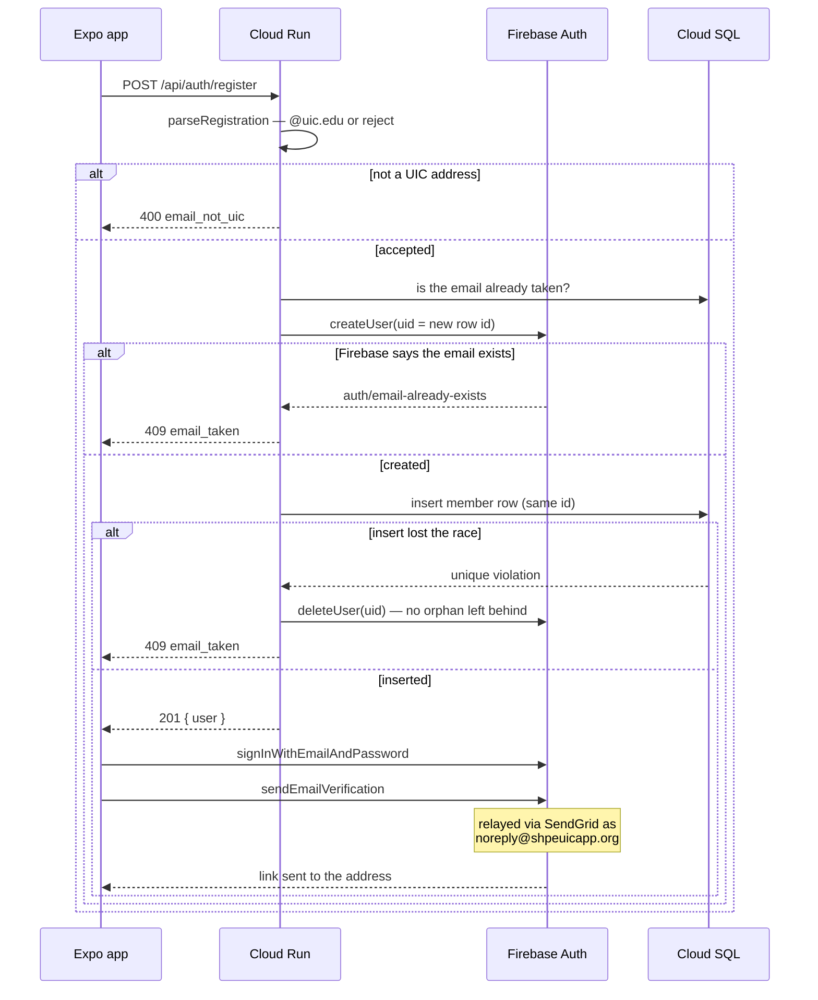

**Firebase mints that link, but does not deliver it.** Identity Platform is
configured for `CUSTOM_SMTP` and relays through SendGrid as
`noreply@shpeuicapp.org`, a domain the chapter owns and publishes DKIM for.
Its own default sender is `noreply@<project>.firebaseapp.com` signed by
`firebaseapp.com` — two different organizational domains under the Public
Suffix List, so DMARC can never align, and `uic.edu` drops the mail without a
bounce. That is a property of the arrangement rather than a misconfiguration,
which is why the fix was a domain and not a code change. See
[EMAIL-DELIVERY.md](EMAIL-DELIVERY.md).

## How a profile picture gets uploaded

The question this answers: *why doesn't the image go through the API?*

Because it does not need to. Cloud Run would spend memory and request time
buffering bytes it has nothing to say about. The API signs a URL for one
specific object and steps out of the way; the size cap is signed into that URL,
so Cloud Storage enforces it rather than the client being trusted.

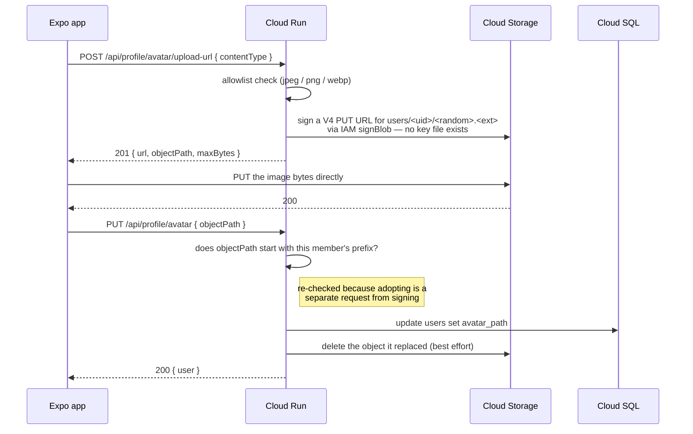

## How the backend modules depend on each other

The question this answers: *why does the migration job need a QR-signing
secret?*

Because `env.ts` validates every required variable the moment it is imported,
and it sits underneath everything — including the database client that
`migrate.ts` pulls in. Any entry point therefore has to satisfy the whole
contract, whether it uses it or not.

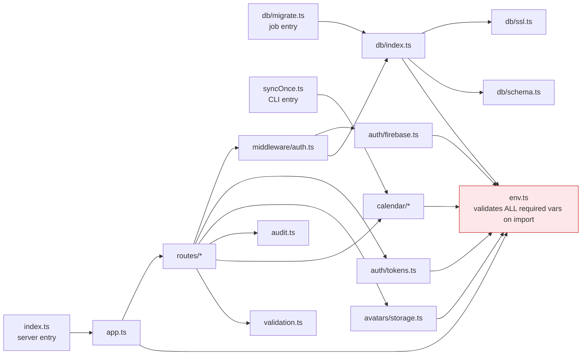

## What the authorization pieces actually expose

The graph above shows *that* modules depend on each other; this shows *what*
they hand each other. Signatures are the real ones — if this drifts from
`backend/src/`, the code is right and this is wrong.

The shape worth noticing: `AuthMiddleware` is the only thing that touches both
Firebase and the database, and it is where identity stops and authorization
starts. Everything to its right deals in a `User` row that has already been
proven to exist.

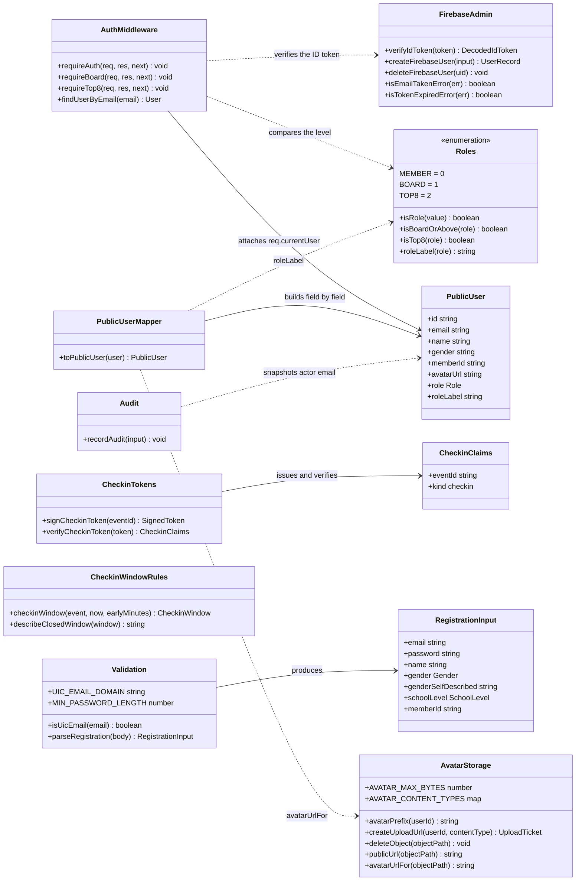

## What changes over time

Three things in this system are state machines, and each one has a transition
that surprises people.

**An announcement is never "published" by anything.** There is no job and no
flag flip — the read query compares `published_at` to `now()`, so a scheduled
post becomes visible because the clock moved, not because code ran.

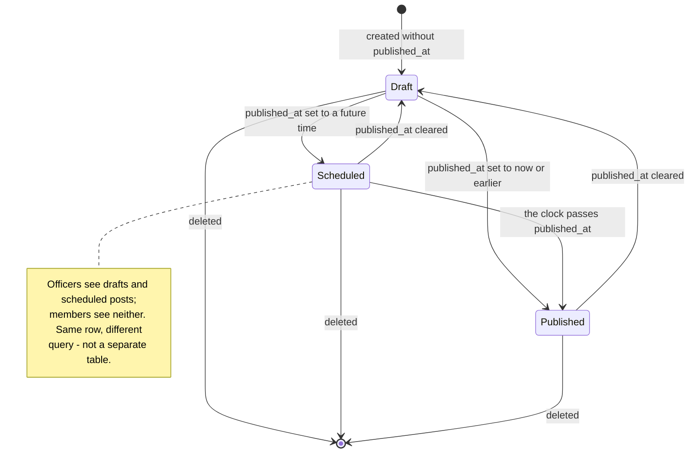

**A session can fail to confirm without ending.** The deliberate part is the
network branch: a member on a bad connection is not signed out, because the
Firebase session is still perfectly valid and the next token refresh retries.
Only a 401 — the member row is gone — actually ends it.

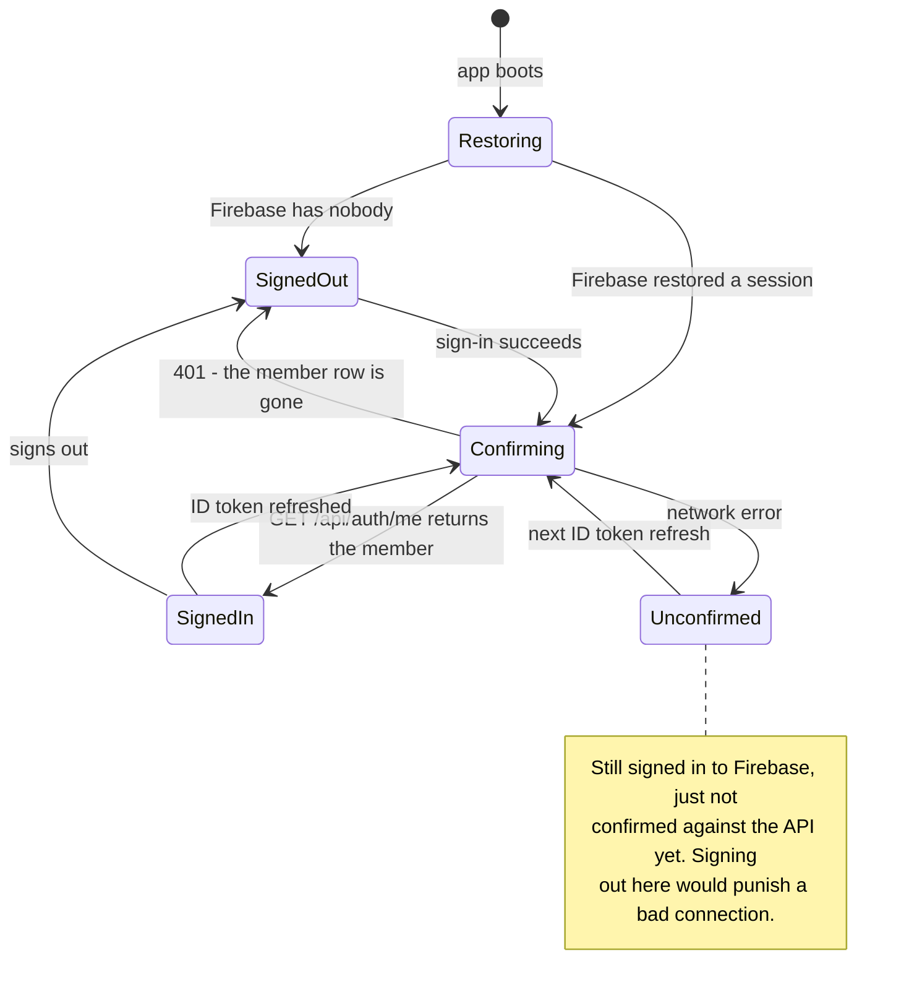

**A check-in window opens early and closes exactly on time.** Members arrive
before the doors open, so scanning starts ahead of the start time; nothing
reopens it once the event has ended.

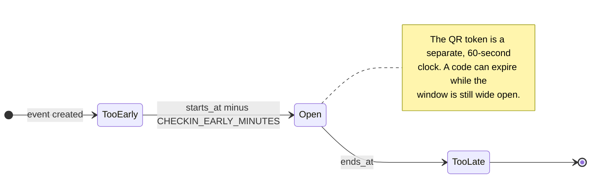

## What the database holds

Six tables. Two things are deliberate and easy to miss: a check-in stores the
points it was worth *at the time*, so re-tagging an event later cannot revalue
attendance already earned; and the audit log snapshots the actor's email and
the thing's name rather than joining, so an entry still reads after either row
is deleted.

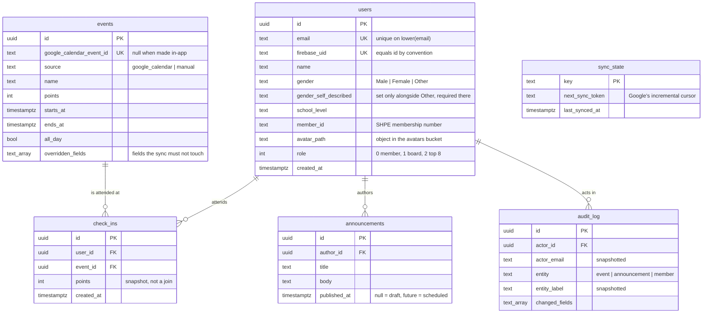

## What Terraform builds, and who may touch it

The question this answers: *why are there three service accounts?*

So that a compromise of the deploy pipeline is not a compromise of the
project. The API can reach the database and its own secrets and nothing else;
the deployer can ship images and static files but cannot create infrastructure;
only the Terraform account can reshape the project, and it runs only when a
human starts it.

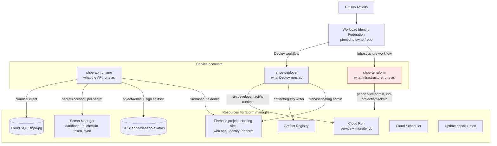

## How a change reaches production

Two workflows, deliberately different in how far they go on their own. App
code deploys itself when it merges; infrastructure does not, because the
Terraform account can change who has access to the project.

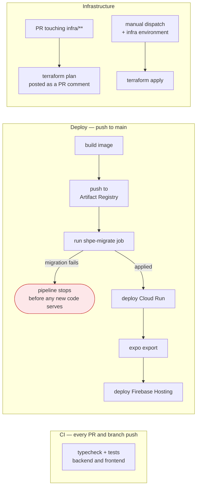

The web build waits for the API on purpose: shipping a screen that calls an
endpoint the server does not have yet is the failure the ordering removes.

---

## Why it differs from the plan

The original design is in [migration.md](../migration.md) and the plans under
[superpowers/plans](superpowers/plans/). Where the built system departs from
them, here is why — several of these were only discoverable by running the
thing.

**Cloud SQL over the managed socket, not a private VPC.** The architecture
diagram that started the migration showed a VPC with a Serverless VPC Access
connector. That connector carries a fixed monthly cost roughly double the
database itself, and buys little here: with no authorized networks, the
instance is already reachable only through IAM-gated connectors. If the
chapter ever needs private IP, it is a change to `ip_configuration` and a
connector — not a redesign.

**No data migration, and no Firebase user import.** The plan budgeted a
downtime window for `pg_dump`/`pg_restore` and a bcrypt hash import so members
would keep their passwords. Both were cancelled once it was clear the old
database held only test accounts. The import script was kept "just in case"
for a while and has now been deleted along with `users.password_hash`, because
keeping an unusable script and a column no row uses is worse than the small
chance of wanting them.

**The uptime check watches `/healthz/db`, not `/healthz`.** Google's frontend
reserves that exact path on `run.app` URLs and answers its own 404 before the
request reaches the container — so the check was failing against a perfectly
healthy service. Cloud Run's own startup probe was unaffected, because probes
bypass that frontend, which is why deploys stayed green while monitoring
claimed the opposite. The deep check is the better target anyway: a database
outage now trips the alert.

**Identity Platform needed `provider = google-beta`.** Every other Firebase
resource declared it; this one did not, so it ran without
`user_project_override`, billed the API call to a Google-owned project, and
failed with a 403 saying `identitytoolkit.googleapis.com` was disabled — on a
project where it is enabled. Setting the ADC quota project does not help: the
provider only sends the override header when told to.

**The migration job is given `CHECKIN_TOKEN_SECRET`,** despite never signing a
token. `env.ts` validates every required variable on import, and `migrate.ts`
reaches it through the database client, so the job crashed before applying
anything. Making that validation lazy per entry point is the real fix and is
on the [todo list](TODO.md); mid-cutover was the wrong moment for it.

**Terraform applies by manual dispatch, not on merge.** Auto-applying is the
tidier GitOps story, but this stack's Terraform manages the project's own IAM,
so the workflow's account holds `roles/resourcemanager.projectIamAdmin`.
Applying on merge would make "who can reach production" a side effect of
approving a pull request. It sits behind the `infra` environment instead,
which since 2026-09-01 requires a second person to approve the run — the
reviewer cannot be whoever dispatched it.

**Deploys run from the team repository.** The old hosts could only build from
a personal mirror, which meant every release needed two pushes and depended on
one officer's account. GitHub Actions has no such constraint, so the mirror
was retired — the deployment now outlives whoever set it up.

**`.gitattributes` pins LF.** Not a design decision, a survival one: editing on
Windows made Git report every file as entirely rewritten, which made pull
requests unreviewable.

**Two Cloud SQL settings are explicitly unmanaged.** The instance API returns
`final_backup_config` and `maintenance_window` whether or not they are
configured, so every plan proposed "removing" them from the production
database. Noise on a plan is not harmless — it is where real drift hides — so
both are declared out of scope with `ignore_changes`.

**Firebase Authentication was in scope at all.** It was originally offered as a
later phase, separable from the hosting move, on the grounds that swapping auth
and swapping infrastructure at once is two risks in one change. The chapter
chose to take both together, which turned out well: the JWT code was deleted
once rather than migrated twice.
